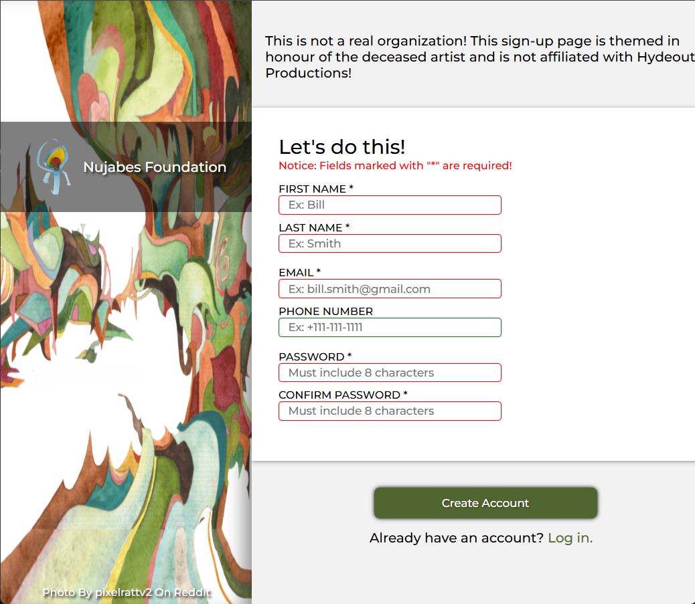

<h1 align="center" id="title">Sign-Up Page</h1>

A basic sign-up page built with HTML and CSS that asks users to enter their first name, last name, email address, phone number, and password. This page is for a fictional Nujabes Foundation, which wouldn’t realistically require a sign-up page, but here we go anyway. **This project is part of The Odin Project's [Intermediate HTML and CSS Course](https://www.theodinproject.com/lessons/node-path-intermediate-html-and-css-sign-up-form)!**

<a href="https://jmagali.github.io/odin-sign-up-form/">View Demo</a>

## Preview

    

## Technologies used
-    
- 